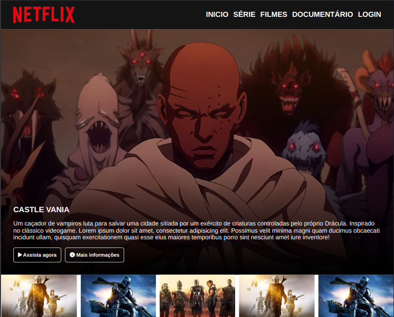
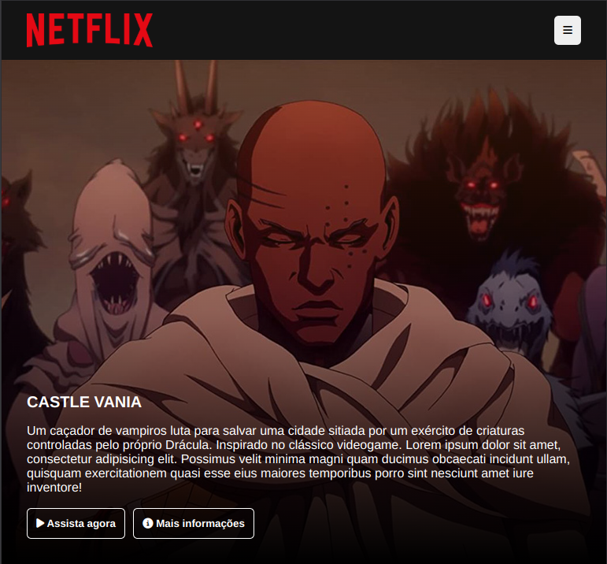
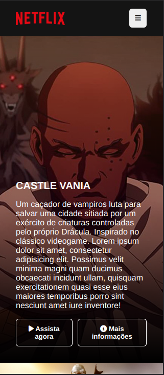
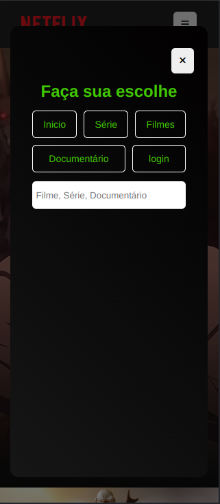

# NETFLIX INTERFACE CLONE
### Another one and lets push it up

Este projeto é uma demonstração de como usar `:after`e `:before`, e também como fazer um modal do zero embora já existindo um popover nativo, como utilizar os conceitos de `flex-wrap` com `flex-grow`.
Usei a biblioteca owl para fazer o carrossel.

Aprendi bastante com ele, e fica na minha lista de modelos para usar enquanto for fazendo meus futuros projetos.

